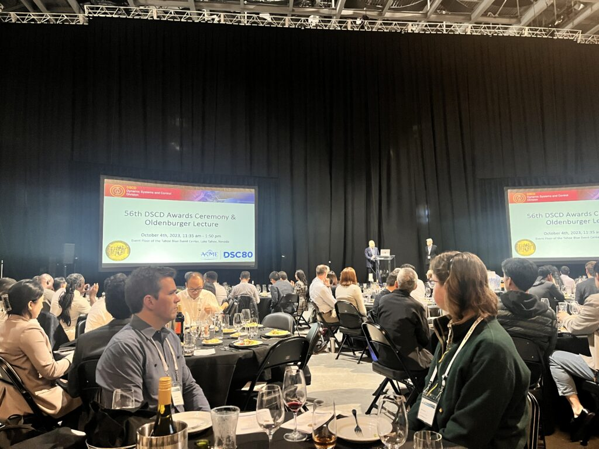
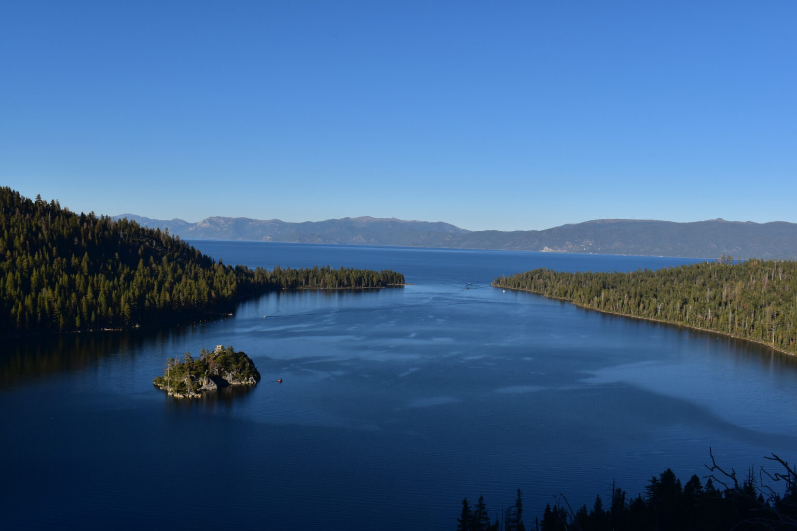

The MACS lab participated in the Modeling, Estimation, and Control Conference (MECC) held at Lake Tahoe. 

<!--more-->
During the event, we hosted a workshop covering a range of topics, including part segmentation, viewpoint generation, camera control, robot controls, and the application of AI for highly precise robotic inspection (Colin Acton, Arun Nandagopal, SangYoon Back).

Other group members also presenting at the conference: Jinhua Ouyang, Navneet Kaur, Neel Jawale, Xiaohai(Bob) Hu.

And we enjoyed the great view of the lake! (Photo credits to Navneet, Dr.Chen, Bob Xiaohai Hu)

