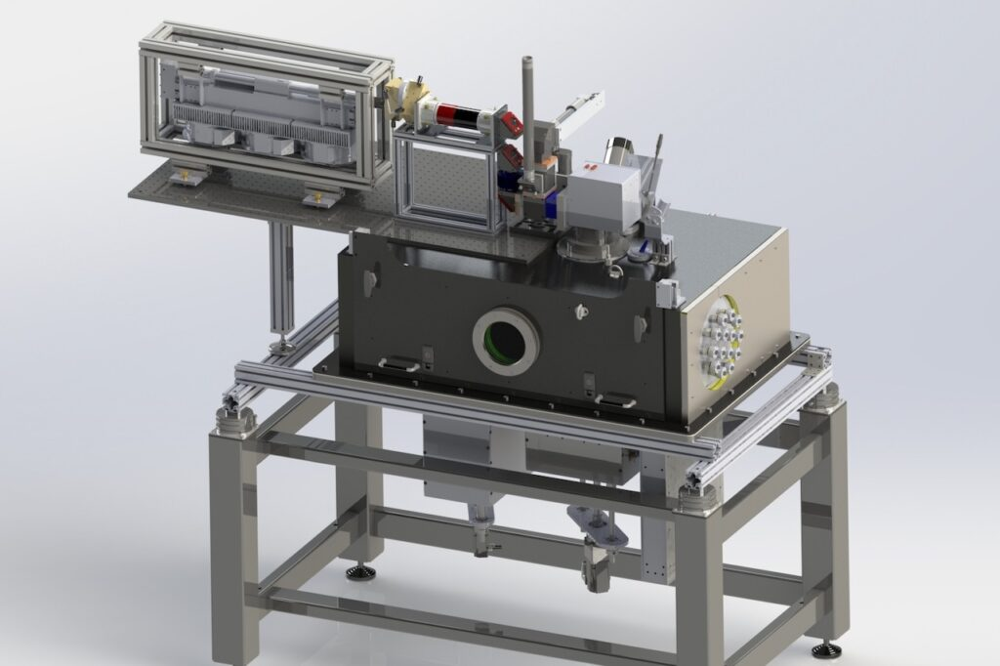

---
title: Additive and Advanced Manufacturing, Precision Control

type: landing

sections:

  - block: markdown
    content:
      title: <small>Eleven Tools in Feedback Control</small>
      subtitle: 
      text: 
        

        <table rules="none">
        <tr>
        <td>
        
 Main contents: • Basics:&nbsp; Arithmetic of LTI systems, Goals of feedback, Loop shaping, Tradeoffs  
        • Fundamental limitations   &ensp;– Bandwidth   &ensp;– Waterbed   &ensp;– Unstable zeros   &ensp;– Magnitude-phase relationship  
        • Practical control engineering   &ensp;– Sampling time   &ensp;– Delays   &ensp;– Time-frequency relationship 

        </td>
        <td>
        
        </td>
        </tr>
        </table>    
        

        # {}
    design:
      columns: '1'
      background:
        image: 
          filename: 
          filters:
            brightness: 1
          parallax: false
          position: center
          size: cover
          text_color_light: true
      spacing:
        padding: ['20px', '0', '20px', '0']
      css_class: container

---