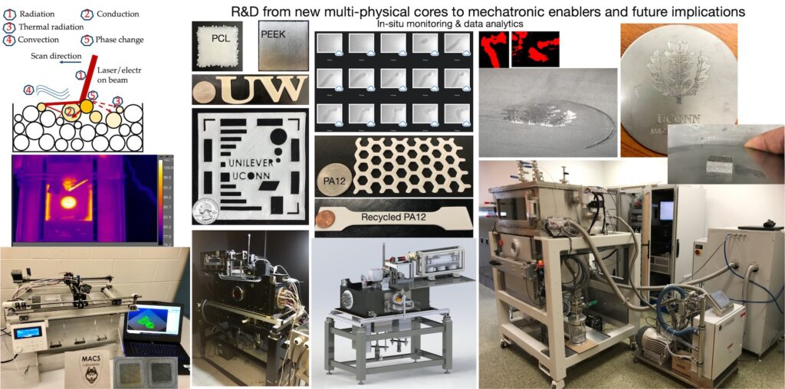
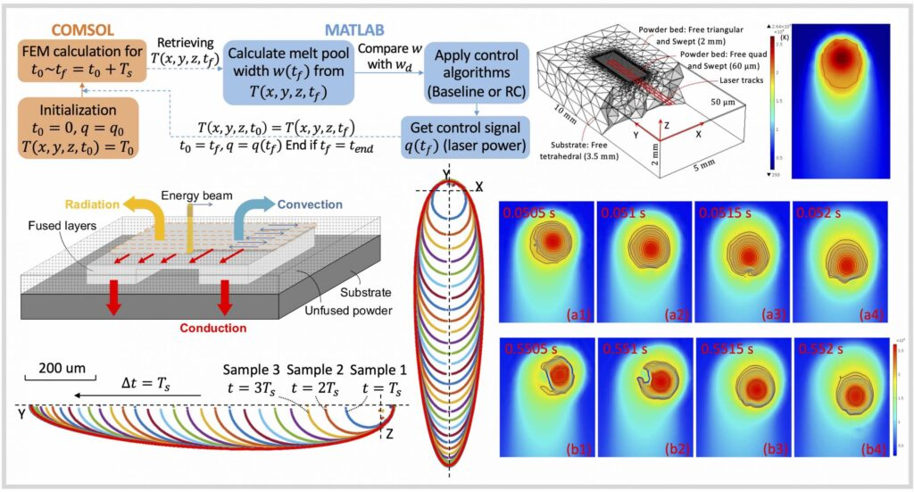
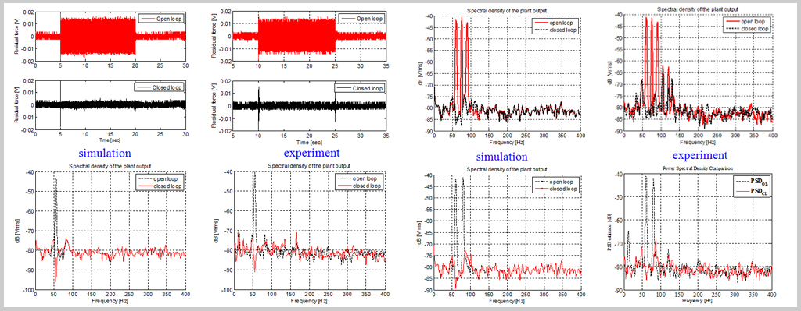
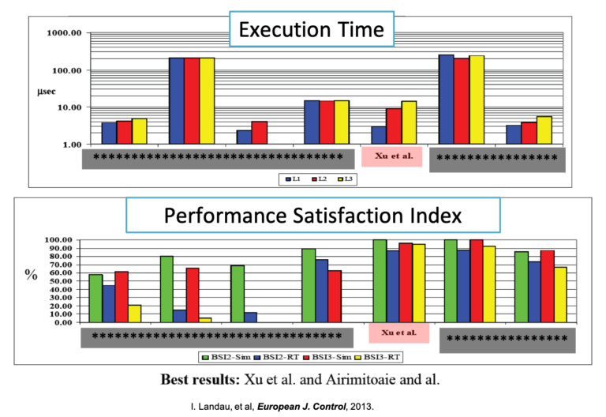

<!--more-->

The design and control of precision systems form an indispensable part of modern engineering. Recent demands in advanced manufacturing are pushing new levels of investigation and understanding of various aspects of complex precision systems. Some of our efforts are summarized below:

---

# Additive manufacturing
Additive manufacturing (AM), a process used to construct 3D parts layer-by-layer directly from digital models, has the potential to overcome various fundamental limitations in traditional manufacturing. Powder bed fusion (PBF), in which new material is added by applying and selectively melting a powdered feedstock, is a popular form of AM for broad applications ranging from advanced jet-engine components to custom-designed medical implants. The objective of this project is to develop an open-configuration powder bed fusion AM (PB FAM) machine as a research testbed that is as close to commercial machines as possible, yet highly flexible for research such as advanced sensing and controls to make sense of the complex physical process, and transformative approaches for sustainable and adaptive mass customization. 

---

# Thermal modeling, sparse sensing, and integrated controls for precise and reliable powder bed fusion
Human has developed a natural feedback control system to learn from errors. The process control in additive manufacturing (AM), however, has not yet found a coherent hardware/software architecture to make fast online corrections in a systematic and provably robust way. This “Achilles’ heel of AM technologies” imposes a formidable challenge for quality certification in industrial production. This project exploits system-theoretical approaches towards critically needed higher accuracy and greater reproducibility in powder bed fusion AM processes.
 testbeds") 

---

# Closed-loop Simulation Integrating FEM with Feedback Controls
While high-fidelity finite element modeling and feedback control have been identified key for predicting and engineering part qualities in PBF, existing results in each realm are developed in opposite computational architectures wildly different in time scale. Integrating both realms, we build a first-instance closed-loop simulation framework by utilizing the output signals retrieved from the finite element model (FEM) to directly update the control signals sent to the model. The proposed closed-loop simulation enables testing the limits of advanced controls in PBF and surveying the parameter space fully to generate more predictable part qualities. Along the course of formulating the framework, we verify the FEM and then use the FEM to understand the melt-pool evolution induced by the in-layer thermomechanical interactions. Please see the details in ISFA2020.

---

# Past Projects

---

# Nanometer-scale motion control and fundamental limitations in feedback control
“Imagine an airplane flying at 500,000 miles per hour but only 1/16 inch above the ground on a highway with 100,000 lanes where the width of each lane is only fraction of an inch. The challenge of the problem is further intensified by the fact that the airplane is expected to switch lanes frequently and then follow the new lane with the same precision. A scaled down version of this scenario is what one finds in the head positioning servomechanism of a hard disk drive.” — A. A. Mamun, G. Guo, and C. Bi, ‘Hard disk drive: mechatronics and control.’ CRC Press, Taylor and Francis Group, London, 2007.

Our work has targeted customizing controls to the performance extreme for mechatronic systems. We created systematic controls to meet the stringent operations of (1) photolithography machines that pack billions of transistors onto a fingernail-sized computer chip in semiconductor manufacturing, (2) active suspensions for ubiquitous vibration mitigation in transportation and heavy machinery, and (3) perhaps the most compact and challenging nanometer-precision system in everyday lives — hard disk drives (HDDs) that provide long-term, high-capacity information storage in data centers.

Below are example simulation and experimental results on an active suspension benchmark system that demonstrate the performance of our solutions. In the summary slides of the benchmark problem, we were honored as–“**Best results (taking into account the steady state, transient, robustness, complexity): Xu et al., Airimitoaie et al., Castellanos at al.**”

---

# Vibration Control in HDDs and active suspensions
Please see details in the [adaptive control and vibration rejection](../) section.
