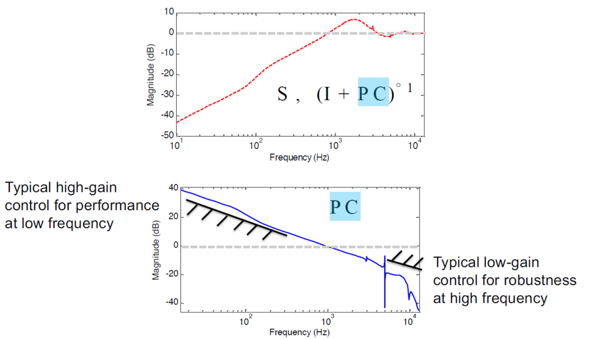

---
# Leave the homepage title empty to use the site title
title: 
date: 2022-10-24
type: landing

sections:
  - block: hero
    content:
      title: |
        Eleven Tools in Feedback Control
      subtitle: Main contents
      image:
        filename: welcome.jpg
      text: |
        • Basics: Arithmetic of LTI systems, Goals of feedback, Loop shaping, Tradeoffs
        • Fundamental limitations
          – Bandwidth 
          – Waterbed
          – Unstable zeros
          – Magnitude-phase relationship
        • Practical control engineering
          – Sampling time
          – Delays
          – Time-frequency relationship
  
  - block: markdown
    content:
      title: Eleven Tools in Feedback Control
      subtitle: 'Main contents'
      text:
        • Basics:&nbsp; Arithmetic of LTI systems, Goals of feedback, Loop shaping, Tradeoffs  
        • Fundamental limitations   &ensp; – Bandwidth   &ensp;– Waterbed   &ensp;– Unstable zeros   &ensp;– Magnitude-phase relationship  
        • Practical control engineering   &ensp;– Sampling time   &ensp;– Delays   &ensp;– Time-frequency relationship
    design:
      columns: '1'
      background:
        image: 
          filename: 
          filters:
            brightness: 1
          parallax: false
          position: center
          size: cover
          text_color_light: true
      spacing:
        padding: ['20px', '0', '20px', '0']
      css_class: container

  - block: markdown
    content:
      title: Eleven Tools in Feedback Control
      subtitle: 'Main contents'
      text:
      

      
        • Basics:&nbsp; Arithmetic of LTI systems, Goals of feedback, Loop shaping, Tradeoffs  
        • Fundamental limitations   &ensp; – Bandwidth   &ensp;– Waterbed   &ensp;– Unstable zeros   &ensp;– Magnitude-phase relationship  
        • Practical control engineering   &ensp;– Sampling time   &ensp;– Delays   &ensp;– Time-frequency relationship
      

    design:
      columns: '1'
      background:
        image: 
          filename: 
          filters:
            brightness: 1
          parallax: false
          position: center
          size: cover
          text_color_light: true
      spacing:
        padding: ['20px', '0', '20px', '0']
      css_class: flex-center
---
